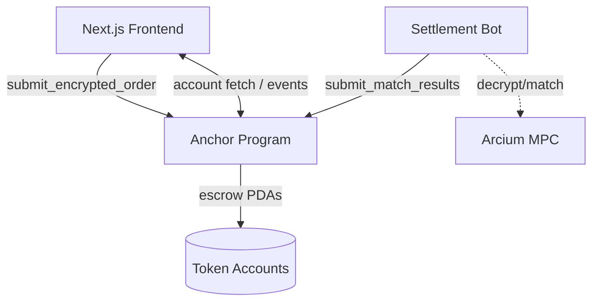
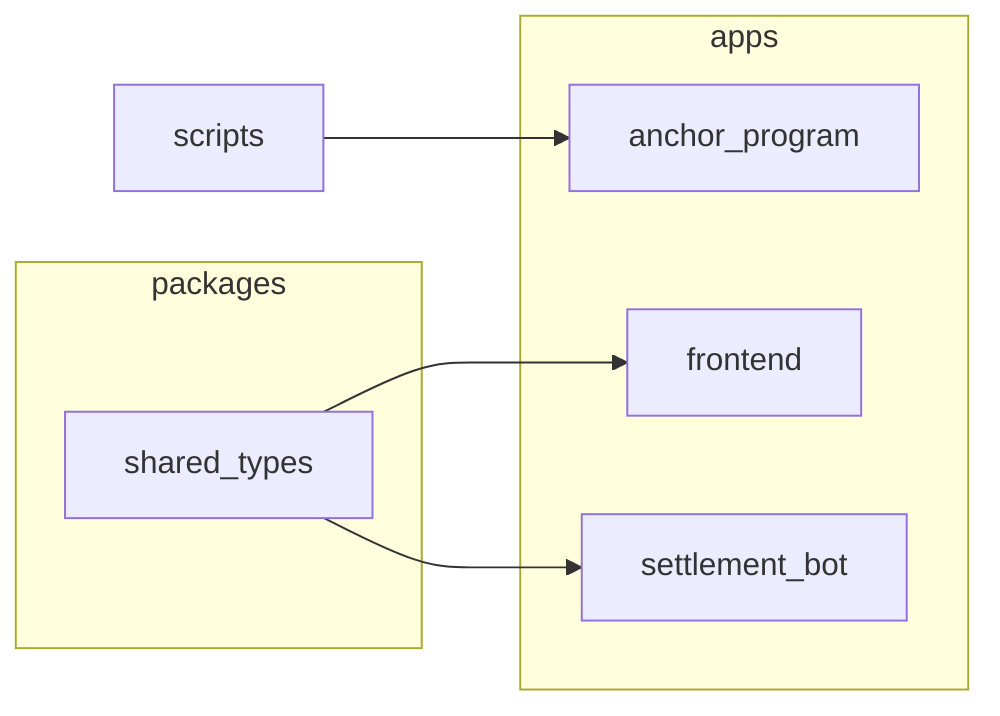

# ShadowSwap Monorepo

ShadowSwap is a privacy-preserving orderbook DEX on Solana. Encrypted orders are posted on-chain, the settlement bot matches them off-chain, and a stateless Anchor program finalizes fills. This repository bundles every moving part—smart contract, Next.js frontend, keeper bot, and shared libraries—under one Yarn workspace so contributors can ship coordinated changes quickly.



## Quick Start

1. **Install dependencies**
   ```bash
yarn install
   ```
2. **Bootstrap devnet state** – deploy the Anchor program, create the order book, and refresh the bot config.
   ```bash
ANCHOR_PROVIDER_URL=https://api.devnet.solana.com \
ANCHOR_WALLET=~/.config/solana/id.json \
yarn anchor:setup
   ```
3. **Run the apps**
   ```bash
# Terminal 1 – frontend
cd apps/frontend && yarn dev

# Terminal 2 – settlement bot
cd apps/settlement_bot && yarn dev
   ```

## Environment Files

- `env.example` – base configuration shared across tooling.
- `apps/frontend/env.example` – RPC, program, and mint IDs for the UI.
- `apps/settlement_bot/.env.example` – keeper runtime settings (RPC, program, Arcium, Sanctum).

Copy the relevant file to `.env`/`.env.local` and tweak before running any command.

## Monorepo Layout

| Path | Description |
| --- | --- |
| `apps/anchor_program` | Anchor smart contract + deployment scripts |
| `apps/frontend` | Next.js 14 UI with wallet adaptor + encryption flow |
| `apps/settlement_bot` | Keeper bot that decrypts, matches, and settles orders |
| `packages/shared_types` | Shared TypeScript definitions reused by the apps |
| `scripts` | Utility scripts (orderbook inspection, cleanup) |



## Development Workflows

### Anchor Program
- Build: `yarn anchor:build`
- Test (against local validator): `yarn anchor:test`
- Deploy to devnet: `SKIP_TESTS=1 anchor deploy` (or run via `yarn anchor:setup`)

The program currently lives at `5Lg1BzRkhUPkcEVaBK8wbfpPcYf7PZdSVqRnoBv597wt`. Default order book PDAs (`63kRwuBA7VZHrP4KU97g1B218fKMShuvKk7qLZjGqBqJ`) pair SOL (`So11111111111111111111111111111111111111112`) with Circle’s devnet USDC (`4zMMC9srt5Ri5X14GAgXhaHii3GnPAEERYPJgZJDncDU`).

### Frontend (Next.js)
- Dev server: `cd apps/frontend && yarn dev`
- Production build: `yarn build && yarn start`
- Lint: `yarn lint`

The UI handles client-side encryption, WSOL wrapping/unwrapping, balance previews, and order management.

### Settlement Bot
- Run locally: `cd apps/settlement_bot && yarn dev`
- Compile: `yarn build`
- Environment keys:
  - `USE_DIRECT_RPC=true` to send transactions straight to devnet.
  - `USE_MOCK_ARCIUM=true` if you want deterministic mock decrypts.
  - `USE_MOCK_SANCTUM=false` to ensure matches really settle.

The bot now validates decrypted payloads, ensures token accounts exist, checks escrow funding, and skips any match that would overflow u64 or fail SPL transfers.

## Testing & Verification

| Layer | Command | Notes |
| --- | --- | --- |
| Anchor Program | `yarn anchor:test` | Uses Anchor’s mocha runner, mocks MPC inputs |
| Frontend | `yarn lint` + browser flows | Hook up Phantom/Solflare on devnet |
| Settlement Bot | `yarn dev` | Logs every matching cycle, RPC submission, and failure reason |

## Maintainer Notes

- **Escrow sanity**: All buy/sell submissions now fund PDA-owned token accounts. If you see `NumericalOverflow` in logs, cancel legacy orders or rerun `yarn anchor:setup` to start with a clean order book.
- **Rate limits**: The bot auto-retries when RPC returns HTTP 429. Adjust `MATCH_INTERVAL` if you need slower polling.
- **Documentation**: Each major folder contains its own `README.md` describing structure, commands, and integration details.

Happy hacking! 🚀
