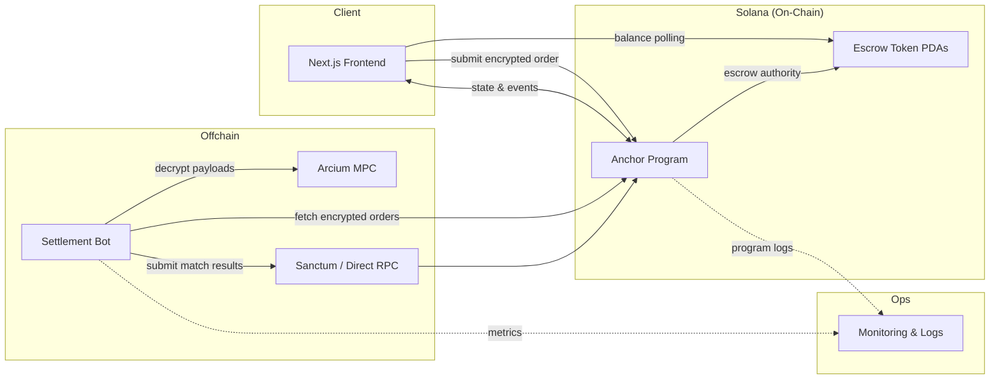

# ShadowSwap Monorepo

ShadowSwap is a privacy-preserving orderbook DEX on Solana. Orders are encrypted in the browser, stored on-chain by an Anchor program, matched off-chain by a keeper, and then settled using stateless instructions. This repository gathers every moving part—program, UI, bot, shared libraries, and tooling—inside a single Yarn workspaces project so contributors can reason about the whole system.

## Demo Video

[Watch the Loom walkthrough](https://www.loom.com/share/34a9da0472f445c4a432f431b3e5e57f) for an overview of the current feature set and developer workflow.

## Highlights

- Hybrid architecture that protects order flow while keeping settlement on Solana L1.
- Single source of truth for account layouts via shared TypeScript definitions.
- Built-in automation for deploying devnet state, inspecting PDAs, and running the keeper loop.

## System Diagram


```mermaid
flowchart LR
  subgraph Client
    FE[Next.js Frontend]
  end
  subgraph "Solana (On-Chain)"
    AP[Anchor Program]
    ESC[Escrow Token PDAs]
  end
  subgraph Offchain
    SB[Settlement Bot]
    MPC[Arcium MPC]
    SAN[Sanctum / Direct RPC]
  end
  subgraph Ops
    OBS[Monitoring & Logs]
  end

  FE -->|submit encrypted order| AP
  FE <-->|state & events| AP
  FE -->|balance polling| ESC

  SB -->|fetch encrypted orders| AP
  SB -->|decrypt payloads| MPC
  SB -->|submit match results| SAN
  SAN --> AP
  AP -->|escrow authority| ESC
  SB -. metrics .-> OBS
  AP -. program logs .-> OBS
```

## Workspace Layout

| Path | Stack | Purpose |
| --- | --- | --- |
| `apps/anchor_program` | Anchor (Rust) | On-chain program, IDL, and deployment scripts. |
| `apps/frontend` | Next.js (TypeScript) | Web client that handles encryption, balances, and trading UI. |
| `apps/settlement_bot` | Node.js (TypeScript) | Keeper that decrypts, matches, and submits settlement transactions. |
| `packages/shared_types` | TypeScript library | Canonical account/type definitions shared across clients. |
| `scripts` | Node.js | Operational helpers for bootstrapping and inspecting devnet state. |
| `docs` | Markdown | Product docs and reference guides (see `docs/README.md`). |
| `Project_Details` | Markdown | Specification notes and design decisions. |
| `ShadowSwap SPA Design` | Next.js prototype | Standalone UI sandbox used for design explorations (pnpm-based). |

## Prerequisites

- Node.js ≥ 16 and Yarn ≥ 1.22 for the workspaces.
- Rust toolchain (via `rustup`), Solana CLI ≥ 1.18, and Anchor CLI ≥ 0.30.
- pnpm ≥ 10.19.0 if you plan to run the `ShadowSwap SPA Design` prototype.
- A Solana keypair funded on devnet for deploying/testing (`~/.config/solana/id.json` by default).

## First-Time Setup

1. Install dependencies:
   ```bash
   yarn install
   ```
2. Build shared type declarations once so downstream apps can compile:
   ```bash
   yarn build:shared
   ```
3. Create environment files:
   ```bash
   cp env.example .env
   cp apps/settlement_bot/.env.example apps/settlement_bot/.env
   # update RPC URLs, program ID, order book PDA, keeper keypair, etc.
   ```
4. (Optional) Deploy and seed the default SOL/USDC order book on devnet:
   ```bash
   ANCHOR_PROVIDER_URL=https://api.devnet.solana.com \
   ANCHOR_WALLET=~/.config/solana/id.json \
   yarn anchor:setup
   ```

## Local Development

### Anchor Program

- `yarn anchor:build` – compile the program.
- `yarn anchor:test` – run the mocha harness against a local validator.
- `yarn anchor:deploy` – deploy using settings in `Anchor.toml`.
- `yarn anchor:inspect` – inspect PDAs with `scripts/inspect-state.ts`.

The default program ID is configured in `apps/anchor_program/Anchor.toml`. Regenerate the IDL after each Rust change and sync `packages/shared_types`.

### Frontend

- `yarn dev:frontend` – start the Next.js development server (defaults to port 3000).
- `yarn build:frontend` / `yarn workspace @shadowswap/frontend lint` – build and lint.
- Provide the RPC URL, program ID, and order book PDAs through `.env.local` variables (`NEXT_PUBLIC_*`).

### Settlement Bot

- `yarn dev:bot` – run the TypeScript keeper with live reload.
- `yarn build:bot` – emit a compiled `dist/` bundle.
- `yarn workspace @shadowswap/settlement-bot test` – execute unit tests (matcher, clients).
- `yarn dev:both` – run bot and frontend concurrently for end-to-end flows.

Review `apps/settlement_bot/.env.example` for the full list of environment switches (direct RPC, mock Arcium, mock Sanctum).

### ShadowSwap SPA Design (optional)

The `ShadowSwap SPA Design/` directory contains a self-contained Next.js 16 prototype used for UI iterations. It is not part of the Yarn workspace; use pnpm to work on it:

```bash
cd "ShadowSwap SPA Design"
pnpm install
pnpm dev
```

## Testing & Quality

| Layer | Command | Notes |
| --- | --- | --- |
| Anchor program | `yarn anchor:test` | Spins up a local validator and runs ts-mocha suites under `apps/anchor_program/tests`. |
| Settlement bot | `yarn workspace @shadowswap/settlement-bot test` | Jest matcher/unit tests (add more as logic evolves). |
| Frontend | `yarn workspace @shadowswap/frontend lint` | Add Vitest/RTL specs for UI changes. |
| Type safety | `yarn build:shared` | Ensures shared declarations stay in sync with the IDL. |

## Helpful Scripts

| Script | Command | Description |
| --- | --- | --- |
| Deploy + seed | `yarn anchor:setup` | Deploys (if needed) and initializes the SOL/USDC order book plus keeper callback auth. |
| Inspect order book | `yarn view:orderbook` | Prints order book configuration and entries for the configured PDA. |
| Clear order book | `yarn clear:orderbook` | Removes all orders and PDAs created by the setup script. |
| Build everything | `yarn build:all` | Shared types → frontend → keeper bot. |

## Documentation & Further Reading

- `docs/README.md` – entry point for user-facing guides and MEV/privacy explainers.
- `apps/**/README.md` – deep dives on the program, bot, and frontend implementations.
- `Project_Details/` – architecture notes and glossary material referenced during the hackathon.
- `scripts/README.md` – reference for operational helpers.

For questions or coordination, open an issue or start a discussion in the repository. Keeping types synchronized (`yarn build:shared`) and documenting Anchor changes in the respective READMEs helps everyone stay aligned.
