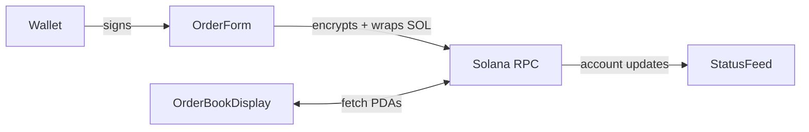

# Frontend (Next.js)

Wallet-facing UI for ShadowSwap. Built with Next.js 14 + React 18, it encrypts orders client-side, wraps/unwraps SOL, and lets users manage submissions and cancellations.

## Features

- Wallet Adapter (Phantom, Solflare, etc.)
- Client-side order encryption (mock Arcium today)
- Automatic WSOL wrapping + unwrapping when selling/cancelling
- Balance panels for WSOL & USDC
- Order dashboard with live status feed (polls every 5 seconds)

## Directory Overview

```
apps/frontend/
├── components/        # Order form, order book, wallet widgets
├── lib/               # Program helpers, encryption mocks, token utils
├── pages/             # Next.js routes (/_app.tsx, index.tsx)
├── public/
├── styles/
└── env.example        # UI-specific environment template
```

## Environment

Copy `env.example` to `.env.local` and adjust:

| Variable | Description |
| --- | --- |
| `NEXT_PUBLIC_RPC_ENDPOINT` | Solana RPC endpoint |
| `NEXT_PUBLIC_PROGRAM_ID` | Anchor program ID (default `5Lg1Bz...`) |
| `NEXT_PUBLIC_ORDER_BOOK_PUBKEY` | PDA for the active order book |
| `NEXT_PUBLIC_BASE_MINT` | Wrapped SOL mint (`So1111...`) |
| `NEXT_PUBLIC_QUOTE_MINT` | Circle devnet USDC (`4zMMC9...`) |
| `NEXT_PUBLIC_REFRESH_INTERVAL` | Auto-refresh interval for order polling |

## Scripts

```bash
# Start dev server with hot reload
yarn dev

# Generate production build
yarn build && yarn start

# Lint source files
yarn lint
```

## Data Flow



When you submit an order the form will:
1. Validate balances (USDC for buys, SOL for sells).
2. Create missing ATAs and wrap SOL if needed.
3. Encrypt the payload and call `submit_encrypted_order`.
4. Refresh balances and order feed after confirmation.

## Troubleshooting

- **`InvalidAccountData` / `insufficient funds`** – make sure the wallet holds actual SPL tokens for the configured mint, not a different devnet USDC.
- **Nothing updates** – confirm `.env.local` points at the latest order book PDA emitted by `yarn anchor:setup`.
- **Wallet errors** – try resetting the `NEXT_PUBLIC_REFRESH_INTERVAL` or reconnecting the wallet adapter.
