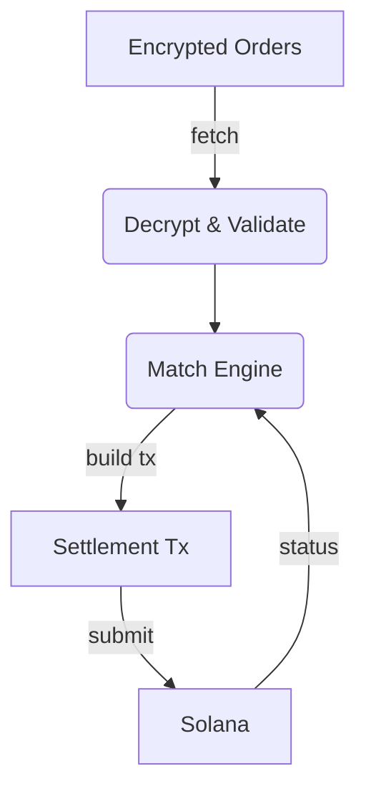

# Settlement Bot (Keeper)

TypeScript daemon that keeps ShadowSwap trustworthy by decrypting orders, matching them off-chain, and submitting `submit_match_results` on-chain.

## Responsibilities

1. **Fetch** PDAs for all ACTIVE/PARTIAL `EncryptedOrder` accounts.
2. **Decrypt** each payload (mock Arcium today) and validate owner/side/amount.
3. **Match** buys vs sells using price-time priority, skipping zero-remain/self matches.
4. **Settle** matches by:
   - Ensuring buyer/seller ATAs exist.
   - Verifying escrow balances.
   - Guarding against u64 overflow.
   - Submitting the Anchor instruction via direct RPC (or Sanctum).



## Setup

```bash
cd apps/settlement_bot
yarn install
cp .env.example .env
# edit .env with real RPC, wallet, Arcium/Sanctum keys
yarn dev
```

### Important Environment Variables

| Key | Description |
| --- | --- |
| `RPC_URL` / `WSS_URL` | Solana RPC + WebSocket endpoints |
| `PROGRAM_ID` | Anchor program ID (default `5Lg1Bz...`) |
| `ORDER_BOOK_PUBKEY` | Active order book PDA |
| `KEEPER_KEYPAIR_PATH` | Keeper signer (must hold SOL + authority) |
| `USE_MOCK_ARCIUM` | `true` = deterministic mock decrypts |
| `USE_DIRECT_RPC` | `true` = send txs directly instead of Sanctum |
| `USE_MOCK_SANCTUM` | keep `false` to actually settle |

## Commands

```bash
# Development run (ts-node)
yarn dev

# Compile to dist/
yarn build

# (Optional) lint/tests
yarn lint && yarn test
```

## File Tour

| File | Purpose |
| --- | --- |
| `src/index.ts` | Main loop, decryption, validation, settlement builder |
| `src/matcher.ts` | Price-time priority matcher + stats |
| `src/arcium-client.ts` | Real + mock MPC clients |
| `src/sanctum-client.ts` | Sanctum + direct RPC submitters |
| `src/types.ts` | Shared TS interfaces |

## Logs to Watch

- `⚠️ Buyer base ATA missing` – bot will create it once and retry.
- `Buyer escrow underfunded` – cancel the stale order; funds were never locked.
- `NumericalOverflow` – indicates legacy orders with unrealistic amounts or price decimals; resubmit with fresh balances.

## Extending the Bot

- Add custom matching strategies by editing `matcher.ts`.
- Plug in a real Arcium SDK by replacing `MockArciumClient` logic.
- Swap Sanctum for another private mempool by implementing `SanctumClient`-like class.

Always ensure the bot’s `.env` references the latest order book PDA emitted by `yarn anchor:setup`.
